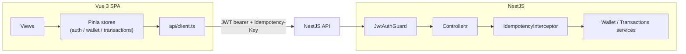

# PayFlow

A small P2P/QR payments app: Vue 3 + TypeScript frontend, NestJS backend. Built as a
portfolio project targeting a fintech frontend role — it deliberately spends its
effort on the things a payments product actually has to get right (idempotent
transfers, input validation, token handling) rather than on breadth of features.

## Stack

- **Frontend:** Vue 3 (Composition API, `<script setup>`), TypeScript, Pinia, Vue
  Router (lazy-loaded routes), Tailwind CSS, Vite, Vitest + Vue Test Utils, Storybook.
- **Backend:** NestJS, TypeScript, class-validator DTOs, Passport JWT, `@nestjs/throttler`,
  Helmet, Jest.
- **Infra:** Dockerfiles for both services, docker-compose for local orchestration,
  GitHub Actions CI (lint → test → build on every PR).

## Running it locally

```bash
# backend
cd backend
cp .env.example .env
npm install
npm run start:dev        # http://localhost:3000/api/v1

# frontend (separate terminal)
cd frontend
npm install
npm run dev               # http://localhost:5173, proxies /api to :3000
```

Demo login: `demo@payflow.dev` / `password123`.

Or via Docker: `docker compose up --build`.

### Tests

```bash
cd backend && npm test        # Jest — service + idempotency-store unit tests
cd frontend && npm run test:unit   # Vitest — utils, Pinia store, component tests
```

## What this project is trying to demonstrate

**Idempotent money movement.** `POST /transactions/transfer` requires an
`Idempotency-Key` header. The frontend mints one UUID per *user intent* to send
money (when the confirm modal opens, in `stores/transactions.ts`) and reuses it
across retries of that same attempt. The backend (`IdempotencyInterceptor` +
`IdempotencyStore`) replays the first response for a repeated key instead of
re-running the transfer, and rejects a second *concurrent* request with the same
key with 409 rather than letting them race. This is the same pattern Stripe's and
PayPal's transfer APIs use, and it's the first thing that's actually load-bearing
in a "send money" flow — without it, a retried request on a flaky mobile network
double-charges the user.

**Defense in depth on the input path.** Amounts are integers in the smallest
currency unit (no floating-point money math), validated on both sides: the
frontend (`utils/validation.ts`) for instant UX feedback, and the backend DTO
(`class-validator` on `CreateTransferDto`) as the actual enforcement point, because
a client-side check can always be bypassed. The backend also whitelists DTO fields
(`forbidNonWhitelisted: true`) so an unexpected field in a request body is rejected
outright rather than silently ignored or passed through.

**Auth tokens are never persisted to `localStorage`.** They live in a Pinia store's
in-memory state only. That's a deliberate trade against convenience (a page refresh
logs you out) in exchange for closing off the "XSS → read localStorage → steal
token" attack path entirely. A production version would pair this with an httpOnly
refresh-token cookie to restore sessions silently.

**Frontend performance basics.** Routes are code-split (`() => import(...)` per
view), so the initial bundle is just the login screen. The transaction history uses
a hand-rolled fixed-height virtual scroller (`VirtualTransactionList.vue`) instead
of rendering every row, so history doesn't degrade as it grows. `utils/webVitals.ts`
wires up Core Web Vitals + INP reporting via `web-vitals`, with a pluggable
transport (console in dev, `sendBeacon` to a RUM endpoint in prod) — the same shape
you'd use to feed New Relic Browser or a custom Kibana dashboard.

**Split-bill rounding.** `SplitBillView.vue` splits an integer yen amount across N
people using `floor(total/n)` plus distributing the `total % n` remainder one yen at
a time, so the shares always sum exactly back to the total instead of losing or
gaining a yen to rounding — a small thing, but the kind of edge case a payments
product can't get wrong.

## What's simplified for a portfolio project

This is explicit on purpose, since glossing over it would undercut the point of
building something security-conscious:

- Users/wallets are in-memory fixtures, not a real database — no persistence across
  restarts.
- Password check is a SHA-256 comparison against a hardcoded demo hash. A real
  system uses bcrypt/argon2 with per-user salts, and the fixture would never exist
  as source code.
- The idempotency store is an in-memory `Map`. At scale this needs to be Redis (or
  a unique DB constraint) so it survives restarts and works across multiple API
  instances behind a load balancer.
- The QR scanner simulates a scan on a timer instead of decoding a real camera
  stream (see the comment in `QrScannerModal.vue` for what a real implementation
  would use).

## Architecture


